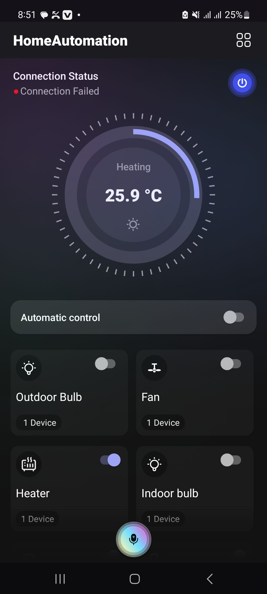
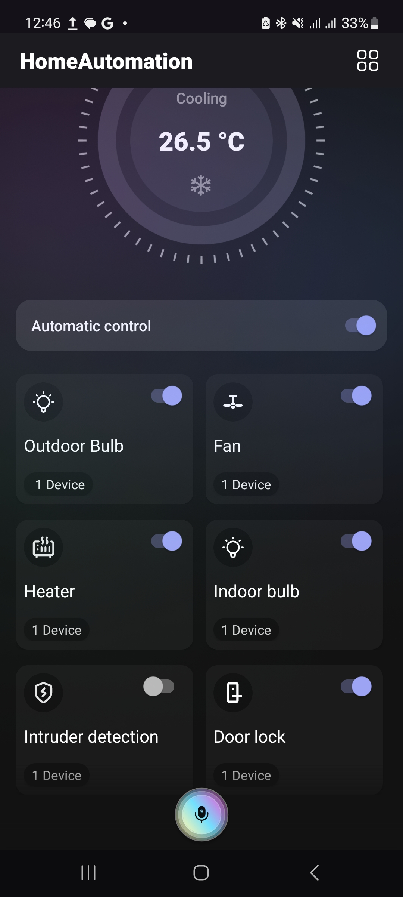
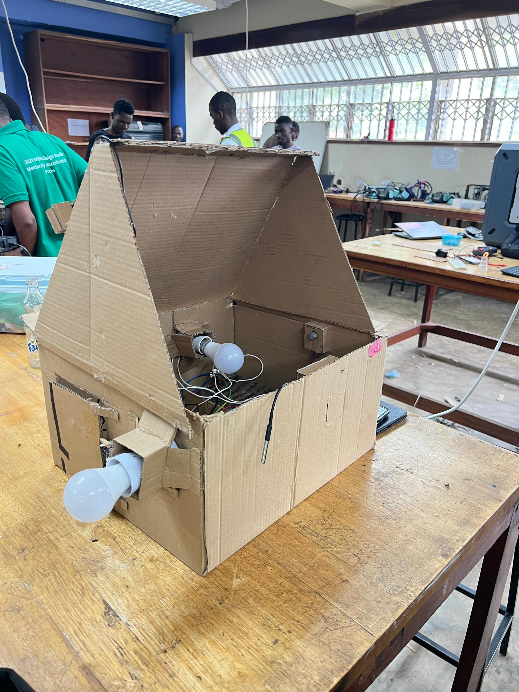

# Home Automation System

This repository contains the code and documentation for a **Home Automation System** developed as part of a school assignment/project. The system was built collaboratively by our group, with the aim of creating a functional prototype that could remotely control home appliances using a mobile application.

## 📱 Android Application

The Android app was developed entirely by me. It serves as the user interface for the home automation system, allowing users to interact with and control various appliances in real-time. The app connects to the backend via **WebSockets and HTTP** to send control signals and receive status updates.

### Features:
- Turn on/off **bulbs**, **fan**, and **heater**
- Open/close **door** using a servo motor
- Real-time feedback from Raspberry Pi

> 📸 **Screenshots of the Android App**
>

>

## 🐍 Python Backend (Raspberry Pi)

The backend system, written in Python, runs on a Raspberry Pi. This component was developed collaboratively as a group. It acts as a server, handling communication between the mobile app and the physical devices connected to the Pi.

### Responsibilities:
- Handle WebSocket and HTTP connections from the Android app
- Control GPIO pins to switch appliances on/off
- Drive the servo motor for door automation
- Provide real-time feedback to the app

> 📸 **Images of the Physical Setup**
>

>

## 🛠️ Hardware Used

- **Raspberry Pi** (with GPIO)
- **Relay modules** (to control AC appliances)
- **Servo motor** (for door control)
- **Bulbs**, **Fan**, **Heater** (for demonstration)
- **WiFi network** (for communication between app and Pi)

## 🎓 Academic Context

This project was developed as part of a university assignment. While the entire team collaborated on the system architecture and Python backend, I took full responsibility for the development of the Android mobile application and ensured its seamless integration with the rest of the system.

## 🤝 Contributions

- **Android App Development** – by me
- **Python Server Logic** – collaborative
- **Hardware Integration** – collaborative
- **Testing and Troubleshooting** – collaborative

## 📂 Project Structure

